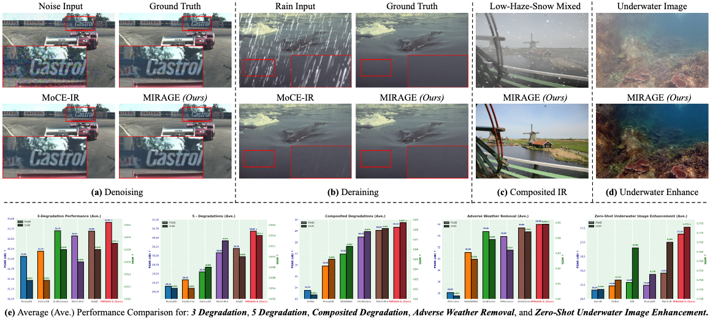

<div align="center">

<h1>
  
  MIRAGE
  
</h1>

<h3><em>Efficient Degradation-agnostic Image Restoration<br/>via Channel-Wise Functional Decomposition and Manifold Regularization</em></h3>

<p>
  <a href="https://arxiv.org/pdf/2505.18679">
    
  </a>
  <a href="https://openreview.net/pdf?id=jDMAvoLsVj">
    
  </a>
  <a href="https://github.com/Amazingren/MIRAGE">
    
  </a>
  
  
  
</p>

<p>
  <a href="https://amazingren.github.io/">Bin Ren</a><sup>1,2</sup> &nbsp;·&nbsp;
  <a href="https://yaweili.bitbucket.io/">Yawei Li</a><sup>3</sup> &nbsp;·&nbsp;
  <a href="https://scholar.google.com/citations?hl=en&user=Ii1c51QAAAAJ">Xu Zheng</a><sup>4</sup> &nbsp;·&nbsp;
  <a href="https://scholar.google.com/citations?user=y3Bpp1IAAAAJ&hl=en&oi=ao">Yuqian Fu</a><sup>5</sup> &nbsp;·&nbsp;
  <a href="https://scholar.google.com/citations?user=W43pvPkAAAAJ&hl=en">Danda Pani Paudel</a><sup>5</sup><br/>
  <a href="https://scholar.google.com/citations?user=WLMUAjsAAAAJ&hl=en">Hong Liu</a><sup>6†</sup> &nbsp;·&nbsp;
  <a href="https://scholar.google.com/citations?user=p9-ohHsAAAAJ&hl=en">Ming-Hsuan Yang</a><sup>7</sup> &nbsp;·&nbsp;
  <a href="https://scholar.google.com/citations?user=TwMib_QAAAAJ&hl=en">Luc Van Gool</a><sup>5</sup> &nbsp;·&nbsp;
  <a href="https://scholar.google.com/citations?user=stFCYOAAAAAJ&hl=en">Nicu Sebe</a><sup>2</sup>
</p>

<p>
  <sup>1</sup>MBZUAI, UAE &nbsp;
  <sup>2</sup>University of Trento, Italy &nbsp;
  <sup>3</sup>ETH Zürich, Switzerland &nbsp;
  <sup>4</sup>HKUST (GZ), China<br/>
  <sup>5</sup>INSAIT Sofia University, Bulgaria &nbsp;
  <sup>6</sup>Peking University, China &nbsp;
  <sup>7</sup>UC Merced, USA<br/>
  <sup>†</sup>Corresponding author
</p>


<p><em>Teaser: (a)–(d) Visual comparison for Denoising, Deraining, Composited Degradations (low-light, haze, and snow), and underwater image enhancement. (e) Average PSNR/SSIM across 4 all-in-one and 1 zero-shot settings.</em></p>

</div>

---

## 🗞️ News

- [ ] 🌐 Project page release
- [ ] 🖼️ Main visual results release
- [x] `05/2026` 🔖 Checkpoints released
- [x] `05/2026` 💻 Code released
- `01/2026` 🍺 MIRAGE accepted at **ICLR 2026**!

---

## 📖 Method

> **TODO** — architecture diagram and method overview coming soon.

---

## 🛠️ Installation

### 1) Environment

```bash
conda create -n mirage python=3.9 -y
conda activate mirage

pip install torch==2.8.0 torchvision==0.23.0 torchaudio==2.8.0 \
    --index-url https://download.pytorch.org/whl/cu129
```

### 2) Dependencies

```bash
pip install -r requirements.txt
```

### 3) CUDA Setup (if needed)

```bash
# Check CUDA availability
nvidia-smi
nvcc --version

# On cluster systems, load via environment modules:
module avail cuda
module load cuda/12.9

# Or set CUDA path manually:
export CUDA_HOME=/usr/local/cuda
export PATH=$CUDA_HOME/bin:$PATH
export LD_LIBRARY_PATH=$CUDA_HOME/lib64:$LD_LIBRARY_PATH
```

---

## 📦 Dataset Preparation

### 1) 3-Degradation & 5-Degradation Settings

We follow dataset preparation from prior works:

- **3-Degradation**: [PromptIR (NeurIPS 2023)](https://github.com/va1shn9v/PromptIR/blob/main/INSTALL.md)
- **5-Degradation**: [AdaIR (ICLR 2025)](https://github.com/c-yn/AdaIR/blob/main/INSTALL.md)

#### Preprocessed Training Sets

> ⚠️ **Important:** Follow original dataset licenses. Provided datasets are for **academic research only**.

| Dehaze | Derain | Denoising | Deblurring | Low-light |
|:------:|:------:|:---------:|:----------:|:---------:|
| [⬇ 11.2G](https://drive.google.com/file/d/13LBouXHNsMKyL5rEpnnpXer2RaBZ1Xwq/view?usp=sharing) | [⬇ 103.6M](https://drive.google.com/file/d/12ugQ-jKevGDSwbi0im5Uh6dLXZXISCou/view?usp=sharing) | [⬇ 3.02G](https://drive.google.com/file/d/1O8k0hXHYn0FtIR7ABViwP1MksGtN0YGa/view?usp=sharing) | [⬇ 3.8G](https://drive.google.com/file/d/1d7ga-ZE4iWTsW-CFnKpTsgWB4d6rHVru/view?usp=sharing) | [⬇ 322.0M](https://drive.google.com/file/d/1P9tVjPp4G4jftG-9VhYv_0-kRpoZimlu/view?usp=sharing) |

<details>
<summary><b>📂 Training directory structure</b></summary>

```
.../datasets/Train/
├── Deblur/
│   ├── blur/
│   └── sharp/
├── Dehaze/
│   ├── train/
│   └── test/
├── Denoise/
│   └── *.bmp / *.jpg
├── Derain/
│   ├── gt/
│   └── rainy/
└── Enhance/
    ├── gt/
    └── low/
```

</details>

<details>
<summary><b>📂 Inference directory structure</b></summary>

> Download preprocessed test sets via [Download]() (covers both 3-Degradation and 5-Degradation settings).

```
.../datasets/test/
├── deblur/
│   └── gopro/
│       ├── input/
│       └── target/
├── dehaze/
│   ├── input/
│   └── target/
├── denoise/
│   ├── bsd68/
│   └── urban100/
├── derain/
│   └── Rain100L/
│       ├── input/
│       └── target/
└── enhance/
    └── lol/
        ├── input/
        └── target/
```

</details>

### 2) CDD11 (Composited / Mixed Degradations)

| Split | Download |
|:-----:|:--------:|
| Train | [⬇ 21.0G](https://drive.google.com/file/d/1lbh4BoL9T210vv4YnW33FbIcoC7vbzk6/view?usp=sharing) |
| Test  | [⬇ 3.5G](https://drive.google.com/file/d/1LzTq3-qy2N8cNWuriqfJvHVaYHeimKQp/view?usp=sharing) |

### 3) 4-Task Adverse Weather Removal

| Train & Test |
|:------------:|
| [⬇ 15.9G](https://drive.google.com/file/d/1l4inlkSWCRIE0LMAc_bQD-cqrZdmLIuT/view?usp=sharing) |

---

## 🔖 Checkpoints

| Model | Params | Download |
|:------|:------:|:--------:|
| 3-Degradation Tiny  | 6M  | [⬇ 72.1M](https://drive.google.com/file/d/1HH6ZkKr-e-kChrgHUc8nuEPDjXcj5H5E/view?usp=sharing) |
| 3-Degradation Small | 10M | [⬇ 111.8M](https://drive.google.com/file/d/1kZqS7AQE93QX9tBtc2Aa8mqFEbauXLZy/view?usp=sharing) |
| 5-Degradation Tiny  | 6M  | [⬇ 72.1M](https://drive.google.com/file/d/1GNjqXsVE7uik5wWpnuPAzC-C05S9DpgO/view?usp=sharing) |
| 5-Degradation Small | 10M | [⬇ 111.8M](https://drive.google.com/file/d/13C-eso1XB5VlTUCmubzrEAB4b_aSsHzb/view?usp=sharing) |
| CDD11 Small | 10M | [⬇ 111.8M](https://drive.google.com/file/d/1GLRMUDfjgWR7aW4DqnUDJzsPO98-cw5G/view?usp=sharing) |

---

## 🖼️ Visual Results

> **TODO** — download links coming soon.

---

## 🚀 Inference

### 1) 3-Degradation Setting

1. Download the checkpoint and place it under `./train_ckpt/3deg_[tiny|small]/`
2. Set the correct project directory and test path in `test_3deg_[tiny|small].sh`
3. Run:

```bash
sh test_3deg_tiny.sh    # Tiny  (6M)
sh test_3deg_small.sh   # Small (10M)
```

### 2) 5-Degradation Setting

1. Download the checkpoint and place it under `./train_ckpt/5deg_[tiny|small]/`
2. Set the correct project directory and test path in `test_5deg_[tiny|small].sh`
3. Run:

```bash
sh test_5deg_tiny.sh    # Tiny  (6M)
sh test_5deg_small.sh   # Small (10M)
```

### 3) CDD11 (Composited / Mixed) Setting

> **TODO**

### 4) 4-Task Adverse Weather Removal

> **TODO**

---

## 🏋️ Training

### 1) 3-Degradation Setting

```bash
sh train_3deg_tiny.sh    # Tiny  (6M)
sh train_3deg_small.sh   # Small (10M)
```

### 2) 5-Degradation Setting

```bash
sh train_5deg_tiny.sh    # Tiny  (6M)
sh train_5deg_small.sh   # Small (10M)
```

### 3) CDD11 (Composited / Mixed) Setting

> **TODO**

### 4) 4-Task Adverse Weather Removal

> **TODO**

---

## 📝 Citation

If you find this work useful, please consider citing:

```bibtex
@inproceedings{ren2026efficient,
  title     = {Efficient Degradation-agnostic Image Restoration via Channel-Wise
               Functional Decomposition and Manifold Regularization},
  author    = {Bin Ren and Yawei Li and Xu Zheng and Yuqian Fu and
               Danda Pani Paudel and Hong Liu and Ming-Hsuan Yang and
               Luc Van Gool and Nicu Sebe},
  booktitle = {The Fourteenth International Conference on Learning Representations (ICLR)},
  year      = {2026}
}
```

---

## 🙏 Acknowledgements

This work was partially supported by the FIS project **GUIDANCE** — *Debugging Computer Vision Models via Controlled Cross-modal Generation* (No. FIS2023-03251).

The codebase builds on excellent prior work:

- [PromptIR (NeurIPS 2023)](https://github.com/va1shn9v/PromptIR)
- [AirNet (CVPR 2022)](https://github.com/XLearning-SCU/2022-CVPR-AirNet)

---

<div align="center">
  <sub>Made with ❤️ · ICLR 2026</sub>
</div>
